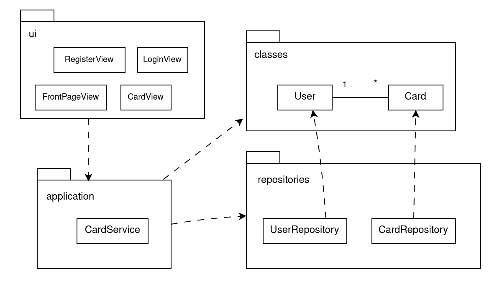
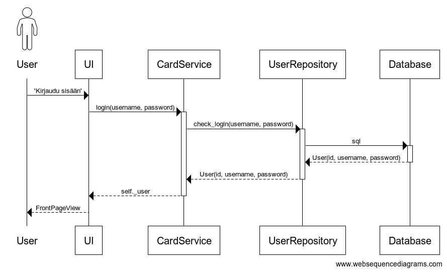

# Arkkitehtuuri  

  

### Rakenne  
Ohjelma pyrkii noudattamaan repository-suunnittelumallia. Sovellus on jaettu neljään osaan: **ui**, **classes**, **repositories** ja **application**. Ui-hakemistossa on käyttöliittymä, kun taas classes sisältää luokat, repositories vastaavasti repositoriot ja application sovelluslogiikan.  

### Käyttöliittymä  
Käyttöliittymässä on neljä eri näkymää, joista jokaisella on oma luokkansa. Ne ovat:  
- **RegisterView** eli rekisteröitymissivu.  
- **LoginView** eli kirjautumissivu.  
- **FrontPageView** eli etusivu johon käyttäjä ohjataan kirjautumisen jälkeen ja jossa voi valita erilaisia toimintoja kuten esim. muistikorttien luominen.  
- **CardView** eli itse muistikortti, jossa on kaksi eri puolta eli kysymys ja vastaus. CardView'ssä käyttäjälle näytetään ensin kysymyspuoli ja painiketta painamalla voi nähdä vastauksen.  

### Sovelluslogiikka  
Sovelluksessa on luokka **User**, joka vastaa sovelluksen käyttäjää ja luokka **Card**, joka vastaa muistikorttia. Käyttäjä voi luoda monia muistikortteja, mutta kullakin muistikortilla voi olla vain 1 luoja eli siihen liittyvä käyttäjä. Käyttäjistä tallennetaan id, käyttäjänimi ja salasana, korteista taas id, kysymys ja vastaus.  
Luokka **CardService** sisältää sovelluslogiikan toiminnot, kuten rekisteröityminen ja kirjautuminen, ja se hyödyntää siinä repositorioita UserRepository ja CardRepository.  

### Datan tallennus  
Repositoriot **UserRepository** ja **CardRepository** vastaavat käyttäjiin ja kortteihin liittyvän datan tallennuksesta. Molemmat repositoriot tallentavat tietoa sqlite3:n avulla tietokantaan tauluihin users ja cards. Tietokanta alustetaan initialize_database-tiedoston avulla.  

### Toiminnallisuus  
#### Rekisteröityminen  
Kun käyttäjä on rekisteröitymissivulla, hän voi valita käyttäjänimen ja salasanan. Salasana syötetään kaksi kertaa jotta ne täsmäävät. Jos syötetyt salasanat eivät ole samat tai käyttäjänimi on jo käytössä, niin siitä tulee virheilmoitus.  
Tapahtumankäsittelijä antaa CardServicen metodille create_new_user parametreina käyttäjänimen ja salasanan, joka edelleen kutsuu UserRepositoryn create_user metodia ja tallentaa tiedot tietokantaan. Mikäli käyttäjän luominen ei onnistu, niin käyttäjälle esitetään virheilmoitus.    
Kun käyttäjä on luotu onnistuneesti, hänet ohjataan kirjautumissivulle jossa hän voi kirjautua sisään uudella tunnuksellaan.  

#### Sisään- ja uloskirjautuminen  
  

Käyttäjä voi syöttää tunnuksen ja salasanan. Tapahtumankäsittelijä kutsuu CardServicen login-metodia, joka edelleen kutsuu UserRepositoryn check_login-metodia, joka taas etsii käyttäjän käyttäjänimen ja salasanan avulla tietokannasta. Jos käyttäjänimeä ja salasanaa vastaava käyttäjä löytyy tietokannasta, niin käyttäjä kirjataan sisään ja sisäinen user-muuttuja muutetaan vastaamaan kyseistä käyttäjää. Jos kirjautuminen ei onnistu (esim. väärän tunnuksen tai salasanan takia), niin käyttäjä saa siitä virheilmoituksen.  
Kun kirjautuminen onnistuu, niin käyttäjä ohjataan etusivulle. Etusivun kautta voi valita suorittaa erilaisia sovelluksen tarjoamia toimintoja, kuten selata aiemmin luotuja muistikortteja tai tehdä uusia muistikortteja.  
Uloskirjautuminen toimii samoin tapahtumakäsittelijän kautta, joka taaskin kutsuu CardServicen logout-metodia. Käyttäjä ohjataan takaisin kirjautumissivulle.  

#### Muistikortit  
Muistikorteilla on kaksi puolta, kysymys ja vastaus. Molemmat niistä annetaan korttia luodessa. Muistikorttinäkymässä näytetään ensin kysymys, ja painiketta painamalla käyttäjä voi valita, milloin haluaa nähdä vastauksen. Kortit voi myöhemmin jakaa pakkoihin aihepiirin mukaan (pakkojen toteutus mahdollisesti esim. cards-tauluun lisätyn attribuutin tai kokonaan uuden tietokantataulun avulla).  
Uutta korttia luodessa tapahtumankäsittelijä kutsuu CardServicen metodia uuden kortin luomiseen, joka edelleen ottaa yhteyttä CardRepositoryyn ja tallentaa tiedot tietokantaan. Kun kortti on luotu, niin käyttöliittymä näyttää tämän luodun kortin korttinäkymän.  